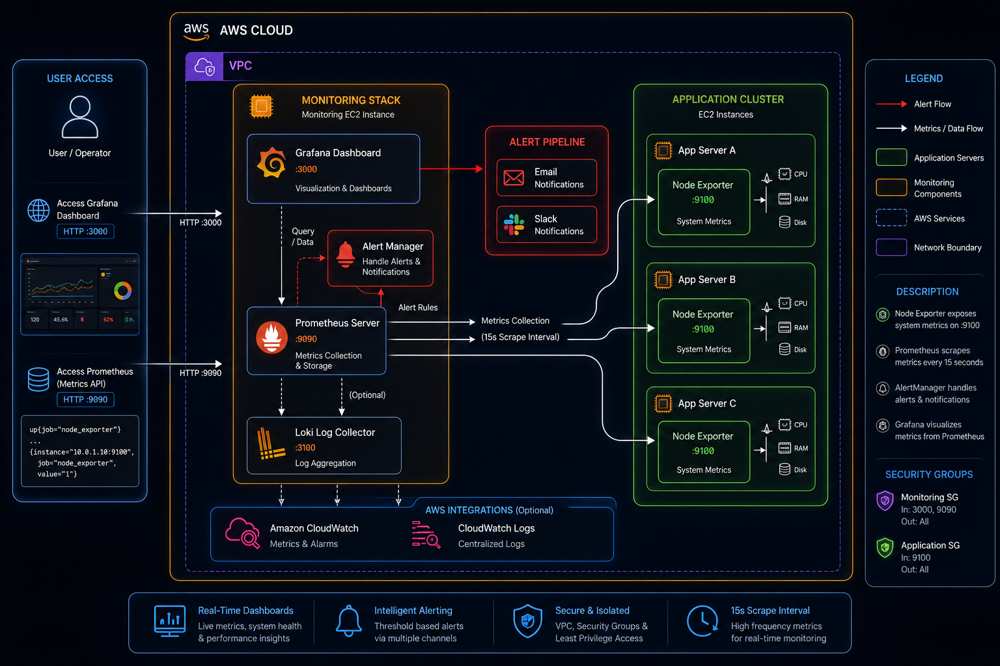

# AWS EC2 Infrastructure Observability Stack with Prometheus & Grafana

## Overview

This project sets up a production-grade observability platform for AWS EC2 instances using Prometheus for metrics collection and Grafana for visualization. Metrics are gathered from multiple target servers via Node Exporter, centralized on a dedicated monitoring node, and surfaced through live dashboards with automated threshold-based alerting.

## System Architecture



### Core Components

1. **Central Monitoring Node** — Dedicated server hosting Prometheus and Grafana
2. **Target Application Nodes** (2x) — Workload servers instrumented with Node Exporter
3. **Prometheus** — Time-series metrics scraping, storage, and rule evaluation
4. **Grafana** — Dashboard rendering and alert visualization
5. **Node Exporter** — Exposes host-level system metrics over HTTP

### Data Flow

Target Nodes run Node Exporter, which exposes system metrics. Prometheus scrapes those metrics on a 15-second interval and evaluates alerting rules. Grafana reads from Prometheus and renders live dashboards. When a rule threshold is breached, an alert transitions from Inactive to Pending to Firing.

## Goal

As an SRE, the aim was to build automated, real-time infrastructure visibility — replacing ad-hoc SSH-based checks for CPU, memory, and disk with a centralized alerting and dashboard solution that catches issues before they cause outages.

## Requirements

- Active AWS account with EC2 permissions
- SSH key pair for instance access
- Familiarity with Linux CLI
- Basic understanding of Prometheus and Grafana concepts

## Setup Guide

All shell commands, configuration files, and YAML snippets referenced in this guide are available in `commands.md` at the root of this repository.

### Step 1: Provision EC2 Instances

#### Central Monitoring Node

1. Log into AWS Console → EC2 → Launch Instance
2. Configure the instance with the following settings:
   - **Name**: Central-Monitor
   - **AMI**: Ubuntu 22.04 LTS (ami-07216ac99dc46a187)
   - **Instance Type**: t2.medium
   - **Key Pair**: Use existing SSH key
   - **Security Group**: Open ports 22 (SSH), 9090 (Prometheus), and 3000 (Grafana)
3. Launch the instance

#### Target Application Nodes

Repeat the above steps twice to create Node-1 and Node-2 with the following settings:

- **Instance Type**: t2.medium
- **AMI**: Ubuntu 22.04 LTS
- **Security Group**: Open ports 22 (SSH) and 9100 (Node Exporter)

### Step 2: Deploy Prometheus and Grafana on the Monitoring Node

SSH into the Central-Monitor instance. Update the package list, download Prometheus v2.48.0, extract it to `/opt/prometheus`, and register it as a systemd service so it starts automatically on boot. Then add the Grafana APT repository, install Grafana, and enable its service. Full commands are in `commands.md` under the "Prometheus and Grafana Installation" section.

### Step 3: Deploy Node Exporter on Target Nodes

SSH into each of the two application nodes. Download Node Exporter v1.7.0, move the binary to `/usr/local/bin/`, and register it as a systemd service. Full commands are in `commands.md` under the "Node Exporter Installation" section.

### Step 4: Configure Prometheus Scrape Targets

Edit `/opt/prometheus/prometheus.yml` on the monitoring node to define the global scrape interval (15s), point to the alerting rules file, and add both application nodes as scrape targets on port 9100. The complete configuration block is in `commands.md` under "Prometheus Configuration".


### Step 5: Define Alerting Rules

Create `/opt/prometheus/alerting_rules.yml` with three rules under the `infrastructure_alerts` group. Each rule uses a 2-minute `for` duration to avoid false positives from transient spikes. The thresholds are CPU above 70%, memory above 80%, and disk above 80%. Full YAML is in `commands.md` under "Alerting Rules".


Restart Prometheus after saving the file to apply the new rules.

### Step 6: Set Up Grafana Dashboards

1. Open Grafana at `http://<monitor-node-ip>:3000` and log in with the default credentials (admin / admin).
2. Navigate to Connections → Data Sources → Add New → Prometheus. Set the URL to `http://localhost:9090` and save.
3. Go to Dashboards → Import, enter Dashboard ID `1860` (Node Exporter Full), select the Prometheus data source, and click Import.

## Dashboard Screenshots

### Scrape Targets Status

All configured targets are being scraped with an UP status:


### Active Alert Rules

Configured alerting rules are loaded and actively evaluating:


### Grafana Live Dashboard

The imported dashboard showing real-time system metrics:


## Alert Validation

### Simulating a CPU Spike

To validate the CPU alert, SSH into a target node, install the `stress` utility, and run it with 4 CPU workers for 300 seconds. This pushes CPU usage above the 70% threshold. Commands are in `commands.md` under "Alert Testing".

The alert fired successfully after 2 minutes of sustained load:


### Alert Lifecycle Observed

1. Opened Prometheus at `http://<monitor-ip>:9090/alerts`
2. Monitored the state transitions: Inactive → Pending → Firing
3. Alert activated once CPU crossed the 70% threshold for 2 or more minutes
4. Alert self-resolved after the stress process terminated

## Metrics Coverage

### CPU

- Per-core utilization
- Idle time ratio
- User and kernel-mode time

### Memory

- Total and available RAM
- Utilization percentage
- Buffer and cache breakdown

### Disk

- Space used vs. available per mount
- Usage percentage
- Read/write I/O rates

### Network

- Inbound and outbound throughput
- Packet counts
- Error and drop rates

### System

- Load averages (1m, 5m, 15m)
- Uptime
- Active process count

## Technology Stack

| Component     | Version        |
|---------------|----------------|
| AWS EC2       | —              |
| Ubuntu        | 22.04 LTS      |
| Prometheus    | v2.48.0        |
| Grafana       | Latest stable  |
| Node Exporter | v1.7.0         |
| Systemd       | Built-in       |

## Repository Layout

```
.
├── config/
│   ├── prometheus.yml          # Prometheus scrape and alertmanager config
│   └── alerting_rules.yml      # Threshold-based alerting rules
├── screenshots/
│   ├── targets-status.png
│   ├── alert-rules-overview.png
│   ├── grafana-live-dashboard.png
│   ├── alert-triggered.png
│   ├── prometheus-config-view.png
│   └── alerting-rules-view.png
├── commands.md                 # All shell commands and config file contents
└── README.md                   # Project documentation
```

## Deliverables

- Prometheus configuration with multi-target scraping
- Alerting rules for CPU, Memory, and Disk thresholds
- Grafana dashboard screenshots with live metrics
- Alert lifecycle demonstration (Inactive → Pending → Firing)
- Full documentation of the observability pipeline

## Troubleshooting Reference

### Prometheus Not Collecting Metrics

Check the Prometheus service logs using `journalctl`, validate the YAML configuration file syntax, and restart the service. Commands are in `commands.md` under "Troubleshooting".

### Node Exporter Offline

Check the Node Exporter service status, review the last 50 log lines, and restart the service if needed. Commands are in `commands.md` under "Troubleshooting".

### Grafana Not Rendering Dashboards

Verify the Grafana server is running, follow the live logs for errors, and restart the service. Commands are in `commands.md` under "Troubleshooting".

## Security Notes

### Security Group Rules

**Monitoring Node:** Port 22 restricted to known IP ranges. Ports 9090 and 3000 open for Prometheus and Grafana access respectively.

**Target Nodes:** Port 22 restricted to known IP ranges. Port 9100 open for Prometheus scraping.

### Hardening Practices Applied

- SSH key-based authentication enforced
- Minimal port exposure via security group rules
- Regular OS patching applied
- Principle of least privilege for service accounts
- Network-level firewall rules configured

## Operational Best Practices

1. **Threshold Calibration** — Set alert thresholds based on observed baseline behavior
2. **Alert Cooldown** — 2-minute `for` duration prevents noise from transient spikes
3. **Dashboard Layout** — Metrics grouped by domain (CPU, memory, disk, network)
4. **Retention Policy** — Configured to balance storage cost and lookback window
5. **Periodic Reviews** — Weekly dashboard audits recommended

## Takeaways

1. **Shift to Proactive Monitoring** — Live dashboards surface issues before users notice
2. **Smart Alerting** — Proper `for` durations significantly reduce false positives
3. **Horizontal Scalability** — New servers can be added to Prometheus with a single config line
4. **Metric Visualization** — Grafana turns raw PromQL into actionable insights
5. **Resilient Services** — Systemd auto-restart ensures zero-touch recovery from crashes

## Access URLs

| Service    | URL                                  | Credentials                          |
|------------|--------------------------------------|--------------------------------------|
| Prometheus | `http://<monitor-node-ip>:9090`      | N/A                                  |
| Grafana    | `http://<monitor-node-ip>:3000`      | admin / admin (change on first login)|

## Teardown

To decommission all resources:

1. Terminate all EC2 instances from the AWS Console
2. Delete associated security groups
3. Remove orphaned EBS volumes if present
4. Release any allocated Elastic IPs


## Outcome

A fully operational observability stack delivering real-time monitoring across multiple EC2 nodes, visual dashboards for CPU, memory, disk, and network metrics, automated threshold alerting with lifecycle management, proactive incident detection ahead of user-facing impact, and elimination of manual SSH-based health checks.

---

**All project deliverables completed. The observability stack is live and actively monitoring infrastructure health.**
